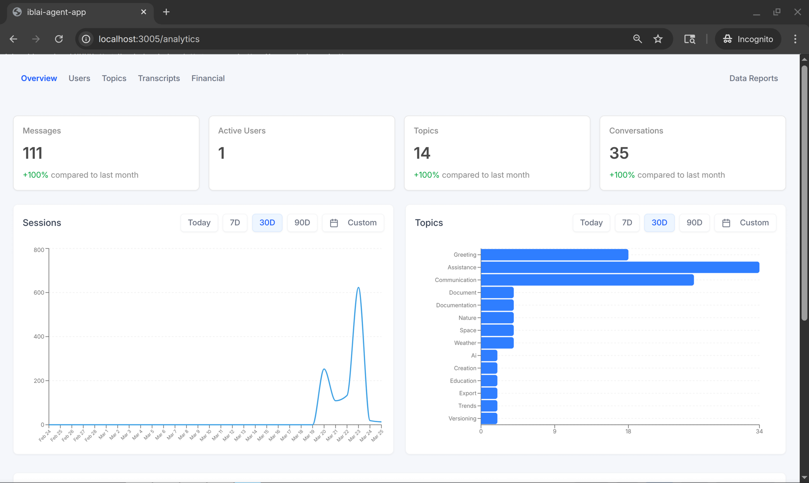

# Add an Analytics Page

Add a full-screen analytics dashboard to your IBL.ai app using the SDK's
analytics components. Supports an overview dashboard as well as a full
tabbed layout with Users, Topics, Financial, Transcripts, and Reports tabs.



## Prerequisites

All required packages are already installed in apps generated by
`iblai startapp agent`. No extra `pnpm add` needed.

Import from `@iblai/iblai-js/web-containers` — analytics components are
framework-agnostic (except Transcripts/Courses/Programs which need Next.js).

---

## Simple: Single-Page Overview

Create `app/(app)/analytics/page.tsx`:

```tsx
"use client";

import { useCallback, useEffect, useState } from "react";
import {
  AnalyticsOverview,
  ChartFiltersProvider,
} from "@iblai/iblai-js/web-containers";
import type { ChartFilters } from "@iblai/iblai-js/web-containers";
import { config } from "@/lib/config";

function resolveTenantKey(raw: string | null): string {
  if (!raw || raw === "[object Object]") return "";
  try {
    const p = JSON.parse(raw);
    if (typeof p === "string") return p;
    if (p?.key) return p.key;
  } catch {}
  return raw;
}

export default function AnalyticsPage() {
  const [tenantKey, setTenantKey] = useState("");
  const [username, setUsername] = useState("");
  const [ready, setReady] = useState(false);

  const handleOutsideFilters = useCallback(
    (_filters: Partial<ChartFilters>) => {},
    []
  );

  useEffect(() => {
    try {
      const raw = localStorage.getItem("userData");
      if (raw) {
        const parsed = JSON.parse(raw);
        setUsername(parsed.user_nicename ?? parsed.username ?? "");
      }
    } catch {}

    const stored =
      localStorage.getItem("current_tenant") ??
      localStorage.getItem("tenant");
    setTenantKey(resolveTenantKey(stored) || config.mainTenantKey());
    setReady(true);
  }, []);

  if (!ready || !tenantKey) {
    return (
      <div
        style={{
          height: "100vh",
          width: "100vw",
          display: "flex",
          alignItems: "center",
          justifyContent: "center",
        }}
      >
        <p style={{ color: "#9ca3af", fontSize: "0.875rem" }}>
          Loading analytics…
        </p>
      </div>
    );
  }

  return (
    <div style={{ height: "100vh", width: "100vw", overflow: "auto" }}>
      <ChartFiltersProvider setOutsideFilters={handleOutsideFilters}>
        <AnalyticsOverview
          tenantKey={tenantKey}
          mentorId=""
        />
      </ChartFiltersProvider>
    </div>
  );
}
```

### Link to the analytics page

```tsx
import Link from "next/link";

<Link href="/analytics">Analytics</Link>
```

---

## Advanced: Full Tabbed Analytics Layout

For the full multi-tab experience (Overview, Users, Topics, Financial,
Transcripts, Reports), set up a layout with sub-routes:

### Layout: `app/(app)/analytics/layout.tsx`

```tsx
"use client";

import { usePathname, useRouter } from "next/navigation";
import { AnalyticsLayout } from "@iblai/iblai-js/web-containers";

export default function AnalyticsLayoutWrapper({
  children,
}: {
  children: React.ReactNode;
}) {
  const pathname = usePathname();
  const router = useRouter();
  const basePath = "/analytics";

  return (
    <AnalyticsLayout
      currentPath={pathname ?? basePath}
      basePath={basePath}
      onTabChange={(tabValue) => router.push(tabValue ? `${basePath}/${tabValue}` : basePath)}
      excludeTabs={["courses", "programs"]}
    >
      {children}
    </AnalyticsLayout>
  );
}
```

### Sub-pages

Create one file per tab:

**`app/(app)/analytics/page.tsx`** — Overview (default)
```tsx
"use client";
import { useCallback } from "react";
import { AnalyticsOverview, ChartFiltersProvider } from "@iblai/iblai-js/web-containers";
import type { ChartFilters } from "@iblai/iblai-js/web-containers";
// ... same tenantKey/username setup as above ...
const handleOutsideFilters = useCallback((_filters: Partial<ChartFilters>) => {}, []);
return <ChartFiltersProvider setOutsideFilters={handleOutsideFilters}><AnalyticsOverview tenantKey={tenantKey} mentorId="" /></ChartFiltersProvider>;
```

**`app/(app)/analytics/users/page.tsx`**
```tsx
import { useCallback } from "react";
import { AnalyticsUsersStats, ChartFiltersProvider } from "@iblai/iblai-js/web-containers";
import type { ChartFilters } from "@iblai/iblai-js/web-containers";
// ... same tenantKey setup + handleOutsideFilters ...
return <ChartFiltersProvider setOutsideFilters={handleOutsideFilters}><AnalyticsUsersStats tenantKey={tenantKey} mentorId="" /></ChartFiltersProvider>;
```

**`app/(app)/analytics/topics/page.tsx`**
```tsx
import { useCallback } from "react";
import { AnalyticsTopicsStats, ChartFiltersProvider } from "@iblai/iblai-js/web-containers";
import type { ChartFilters } from "@iblai/iblai-js/web-containers";
// ... same tenantKey setup + handleOutsideFilters ...
return <ChartFiltersProvider setOutsideFilters={handleOutsideFilters}><AnalyticsTopicsStats tenantKey={tenantKey} mentorId="" /></ChartFiltersProvider>;
```

**`app/(app)/analytics/financial/page.tsx`**
```tsx
import { useCallback } from "react";
import { AnalyticsFinancialStats, ChartFiltersProvider } from "@iblai/iblai-js/web-containers";
import type { ChartFilters } from "@iblai/iblai-js/web-containers";
// ... same tenantKey setup + handleOutsideFilters ...
return <ChartFiltersProvider setOutsideFilters={handleOutsideFilters}><AnalyticsFinancialStats tenantKey={tenantKey} mentorId="" /></ChartFiltersProvider>;
```

**`app/(app)/analytics/transcripts/page.tsx`** *(requires Next.js)*
```tsx
import { useCallback } from "react";
import { AnalyticsTranscriptsStats, ChartFiltersProvider } from "@iblai/iblai-js/web-containers";
import type { ChartFilters } from "@iblai/iblai-js/web-containers";
// ... same tenantKey setup + handleOutsideFilters ...
return <ChartFiltersProvider setOutsideFilters={handleOutsideFilters}><AnalyticsTranscriptsStats tenantKey={tenantKey} mentorId="" /></ChartFiltersProvider>;
```

**`app/(app)/analytics/reports/page.tsx`**
```tsx
import { useCallback } from "react";
import { AnalyticsReports, ChartFiltersProvider } from "@iblai/iblai-js/web-containers";
import type { ChartFilters } from "@iblai/iblai-js/web-containers";
// ... same tenantKey setup + handleOutsideFilters ...
return <ChartFiltersProvider setOutsideFilters={handleOutsideFilters}><AnalyticsReports tenantKey={tenantKey} selectedMentorId="" /></ChartFiltersProvider>;
```

---

## Props Reference

### `AnalyticsOverview` (and all other analytics components)

| Prop | Type | Description |
|------|------|-------------|
| `tenantKey` | `string` | Tenant/org key |
| `mentorId` | `string` | Mentor unique ID. Pass `""` for org-wide analytics. |
| `selectedMentorId` | `string?` | Filter analytics to a specific mentor |
| `usergroupIds` | `string[]?` | Filter analytics to specific user groups |

### `AnalyticsLayout`

| Prop | Type | Description |
|------|------|-------------|
| `currentPath` | `string` | Current pathname (from `usePathname()`) |
| `basePath` | `string` | Base path for analytics routes (e.g., `"/analytics"`) |
| `onTabChange` | `(tabValue: string) => void` | Called when user clicks a tab — receives the tab value (e.g. `"users"`), not the full path. Prepend `basePath` yourself: `router.push(tabValue ? \`${basePath}/${tabValue}\` : basePath)` |
| `excludeTabs` | `string[]?` | Tab IDs to hide (e.g., `["courses", "programs"]`) |
| `children` | `ReactNode` | The page content for the current tab |

### `ChartFiltersProvider`

Wrap all analytics components with `ChartFiltersProvider` — it provides
time-range filter state (`activeFilter`, `dateRange`) to all charts via context.

| Prop | Type | Description |
|------|------|-------------|
| `children` | `ReactNode` | Analytics components to wrap |
| `setOutsideFilters` | `(next: Partial<ChartFilters>) => void` | **Required.** Callback invoked when filters change. Use a no-op `useCallback(() => {}, [])` if you don't need external filter sync. |
| `initialFilters` | `Partial<ChartFilters>?` | Optional initial filter state |

---

## Important Notes

- **Import**: `@iblai/iblai-js/web-containers` — analytics components are
  framework-agnostic except `AnalyticsTranscriptsStats`, `AnalyticsCourses`,
  and `AnalyticsPrograms` which require `next/navigation`
- **Redux store**: Must include `mentorReducer` and `mentorMiddleware` from
  `@iblai/iblai-js/data-layer` (included in generated apps)
- **`initializeDataLayer()`**: Must be called with 5 args —
  `(dmUrl, lmsUrl, legacyLmsUrl, storageService, httpErrorHandler)` (v1.2+ signature)
- **RTK dedup**: `@reduxjs/toolkit` is deduplicated via webpack aliases
- **`mentorId` empty string**: For org-wide analytics pass `""` not `undefined`


