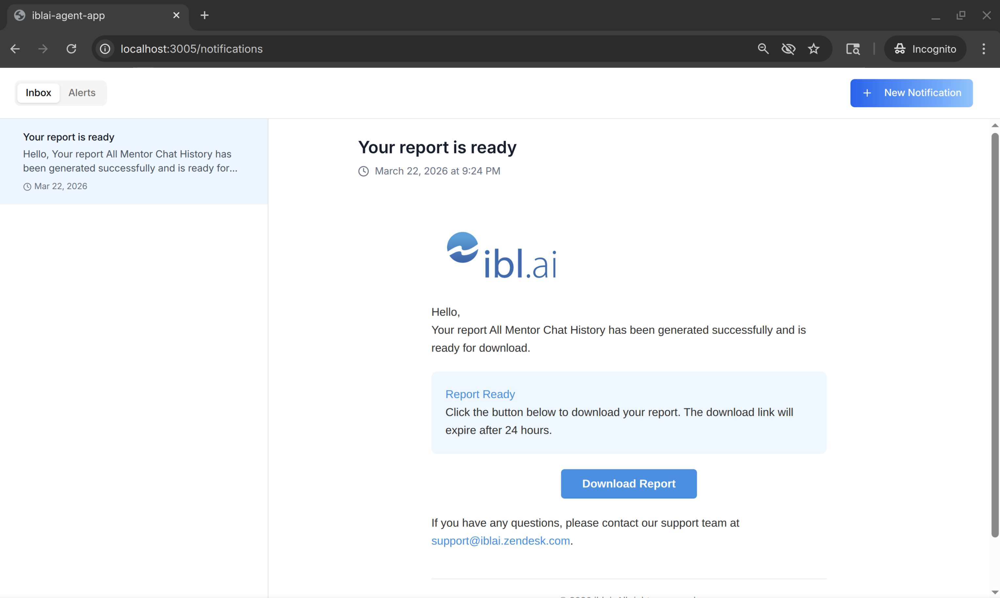

# Add a Notifications Page

Add a full-screen notification center to your IBL.ai app using the SDK's
`NotificationDisplay` component. The page includes an Inbox tab (list +
detail view) and an Alerts tab (admin only — manage notification templates).



## Prerequisites

All required packages are already installed in apps generated by
`iblai startapp agent`. No extra `pnpm add` needed.

Import from `@iblai/iblai-js/web-containers` — notification components are
fully framework-agnostic (no Next.js dependency).

---

## Create `app/(app)/notifications/page.tsx`

```tsx
"use client";

import { useEffect, useState } from "react";
import { NotificationDisplay } from "@iblai/iblai-js/web-containers";
import { config } from "@/lib/config";

function resolveTenantKey(raw: string | null): string {
  if (!raw || raw === "[object Object]") return "";
  try {
    const p = JSON.parse(raw);
    if (typeof p === "string") return p;
    if (p?.key) return p.key;
  } catch {}
  return raw;
}

export default function NotificationsPage() {
  const [tenantKey, setTenantKey] = useState("");
  const [username, setUsername] = useState("");
  const [isAdmin, setIsAdmin] = useState(false);
  const [ready, setReady] = useState(false);

  useEffect(() => {
    // username
    try {
      const raw = localStorage.getItem("userData");
      if (raw) {
        const parsed = JSON.parse(raw);
        setUsername(parsed.user_nicename ?? parsed.username ?? "");
      }
    } catch {}

    // tenant key
    const stored =
      localStorage.getItem("current_tenant") ??
      localStorage.getItem("tenant");
    const resolved = resolveTenantKey(stored) || config.mainTenantKey();
    setTenantKey(resolved);

    // isAdmin — from tenants array
    try {
      const tenantsRaw = localStorage.getItem("tenants");
      if (tenantsRaw) {
        const tenants = JSON.parse(tenantsRaw);
        const match = tenants.find((t: any) => t.key === resolved);
        if (match) setIsAdmin(!!match.is_admin);
      }
    } catch {}

    setReady(true);
  }, []);

  if (!ready || !tenantKey || !username) {
    return (
      <div
        style={{
          height: "100vh",
          width: "100vw",
          display: "flex",
          alignItems: "center",
          justifyContent: "center",
        }}
      >
        <p style={{ color: "#9ca3af", fontSize: "0.875rem" }}>
          Loading notifications…
        </p>
      </div>
    );
  }

  return (
    <div style={{ height: "100vh", width: "100vw", overflow: "auto" }}>
      <NotificationDisplay
        org={tenantKey}
        userId={username}
        isAdmin={isAdmin}
      />
    </div>
  );
}
```

### Link to the notifications page

```tsx
import Link from "next/link";

<Link href="/notifications">Notifications</Link>
```

---

## Deep-linking to a Specific Notification

To open the notifications page with a specific notification pre-selected
(e.g. from a push notification or external link), add a dynamic sub-route:

**`app/(app)/notifications/[notificationId]/page.tsx`**

```tsx
"use client";

import { use } from "react";
import { useEffect, useState } from "react";
import { NotificationDisplay } from "@iblai/iblai-js/web-containers";
import { config } from "@/lib/config";

// ... same tenantKey/username/isAdmin setup as above ...

export default function NotificationDetailPage({
  params,
}: {
  params: Promise<{ notificationId: string }>;
}) {
  const { notificationId } = use(params);
  // ... setup tenantKey, username, isAdmin ...

  return (
    <div style={{ height: "100vh", width: "100vw", overflow: "auto" }}>
      <NotificationDisplay
        org={tenantKey}
        userId={username}
        isAdmin={isAdmin}
        selectedNotificationId={notificationId}
      />
    </div>
  );
}
```

---

## NotificationBell (navbar widget)

The `NotificationBell` component is already pre-generated at
`components/iblai/notification-bell.tsx`. Use it in your navbar with an
`onViewAll` callback to navigate to the notifications page:

```tsx
import { IblaiNotificationBell } from "@/components/iblai/notification-bell";
import { useRouter } from "next/navigation";

function Navbar() {
  const router = useRouter();
  return (
    <nav>
      <IblaiNotificationBell
        onViewAll={() => router.push("/notifications")}
      />
    </nav>
  );
}
```

---

## Props Reference

### `NotificationDisplay` (full-page notification center)

| Prop | Type | Description |
|------|------|-------------|
| `org` | `string` | Tenant/org key |
| `userId` | `string` | Username (`user_nicename`) |
| `isAdmin` | `boolean?` | Shows Alerts tab + Send button for admins |
| `selectedNotificationId` | `string?` | Pre-select a notification on load |
| `enableRbac` | `boolean?` | Enable fine-grained RBAC permission checks |
| `rbacPermissions` | `object?` | RBAC permissions from Redux store |
| `tenant` | `string?` | Alias for `org` |
| `className` | `string?` | Additional CSS class for the container |

### `NotificationDropdown` (bell icon — in pre-generated `notification-bell.tsx`)

| Prop | Type | Description |
|------|------|-------------|
| `org` | `string` | Tenant/org key |
| `userId` | `string` | Username |
| `isAdmin` | `boolean?` | Controls send button visibility |
| `onViewNotifications` | `(id?: string) => void?` | Called when "View all" is clicked |

---

## Features by Role

| Feature | Everyone | Admin only |
|---------|----------|-----------|
| Inbox (unread/read notifications) | ✓ | ✓ |
| Mark as read / Mark all as read | ✓ | ✓ |
| Notification detail view | ✓ | ✓ |
| Send notification dialog | | ✓ |
| Alerts tab (manage templates) | | ✓ |
| Edit alert templates | | ✓ |

---

## Important Notes

- **Import**: `@iblai/iblai-js/web-containers` — fully framework-agnostic,
  no `next/*` imports required
- **Redux store**: Must include `mentorReducer` and `mentorMiddleware` from
  `@iblai/iblai-js/data-layer` (included in generated apps)
- **`initializeDataLayer()`**: Must be called with 5 args (v1.2+ signature)
- **RTK dedup**: `@reduxjs/toolkit` is deduplicated via webpack aliases
- **Admin detection**: Derive `isAdmin` from the `tenants` array in localStorage
  by matching `t.key === tenantKey` and reading `t.is_admin`
